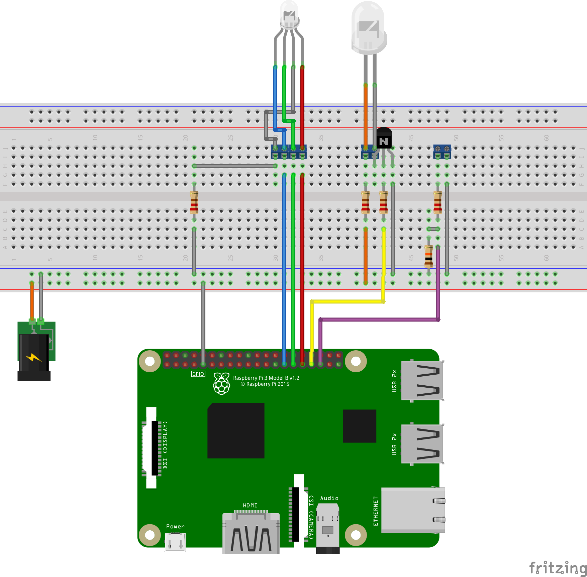

# open-birdhouse

## Installation

### UI
tbd

### Server
tbd

## Hardware / Wiring
Let me be honest from the beginning: I almost didn't graduate from high school because of my poor grades in electrical engineering.  
The circuit, especially the dimensioning of the resistors may be wrong. It is the result of my amateurish soldering session.  

**Please rebuild this only if you know what you are doing! I do not take any liability for damages.**  
Please contribute with your feedback on that, if you are an expert on electronics.  

## Contribution
This project is open source. Share it, modify it and play with it. I'm happy to take your feedback and I am open for suggestions and pull requests.